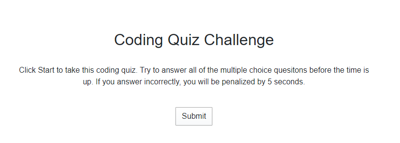
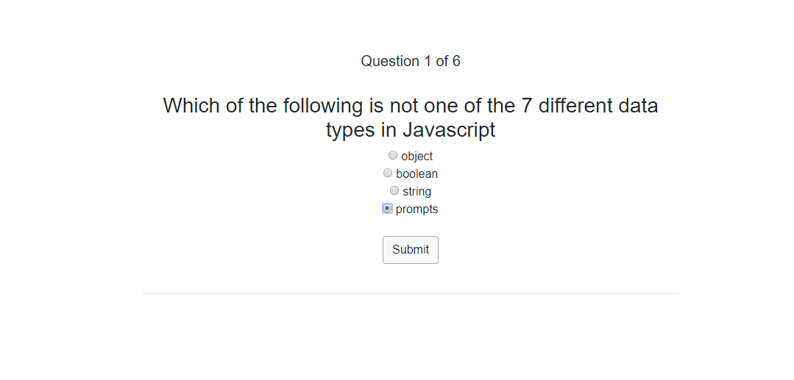
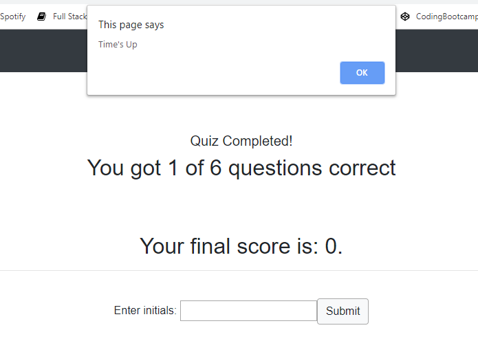
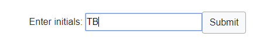
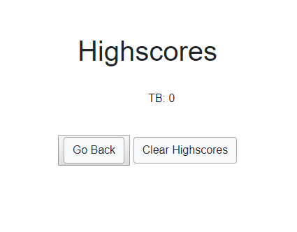

# Coding Quiz 

Test your coding abilities by taking this short quiz. Positive answers get you +5 points, incorrect answers get you -1 points. Try and complete the quiz before the time runs out. If you answer a question incorrectly you will be penalized 5 seconds. At the end record your high score and see how others have done too. 

# Instructions: 

### Step 1: Click submit to begin quiz.

### Step 2: Select the right answer to the question

### Step 3: If you run out of time you'll see this message.

### Step 4: Enter your initials

### Step 5: View highscores

